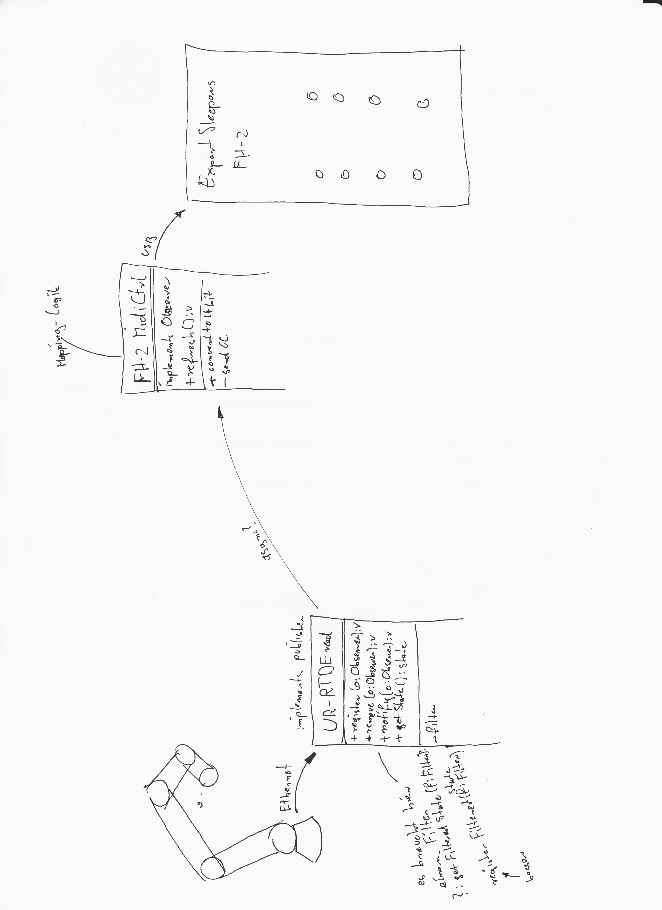

# Get data from a Universal Robot UR
This tool follows loosely implemented publisher observer pattern to read and process robot data.

For observers and publishers are interfaces implemented. Read more about interfaces in python here: https://realpython.com/python-interface/

# Publisher
There is one publisher, which is reading data from a queue. You can register observers at this publisher, which get notified when data is available. 

# Observers
## OSCSender
Sends robotdata via osc on **port 10000**.

The messages are build in a pattern like: `/ur5e/MESSAGECONTENT PAYLOAD`, e.g.: `/ur5e/actualQ 0.3 0.5 0.2 0.4 0.1 0.2`

The content is:
* **actualQ:** the actual joint positions (6 values: j0 - j5) in radians
* **actualTCPPose** the actual tool center point pose (6 values: X, Y, Z, rX, ry, rZ)

## ExpertSleepers FH-2
Used to send data via midi to a FH-2 by Expert Sleepers

https://www.expert-sleepers.co.uk/downloads/manuals/fh2_user_manual_1.19.pdf

**14 bit MIDI CCs:** 
 Some of the FH-2 parameters use a 14 bit representation for higher accuracy: specifically, the Direct levels, the LFO Speed and the LFO Multiplier.
 
 A convention exists for sending 14 bit values via MIDI CCs, using two CCs (of 7 bits each). The high 7 bits are sent on a CC in the range 0-31, and the low 7 bits are sent on the CC numbered 32 higher (which is therefore in the range 32-63). The low 7 bits are sent first.
 
 The FH-2 configures this automatically, if
 * one of the three 14 bit quantities is mapped to CC in the range 0-31, and
 * the corresponding low bits CC is not mapped to anything else.
 
 For example, say the direct level on output 5 is mapped to CC 4 on MIDI channel 1 (as it is in the default configuration). Then CC 36 (36 being 4 + 32) on MIDI channel 1 is automatically mapped as the low 7 bits, unless that CC has been explicitly mapped to control something else.
 
 Note that this doesn't mean you have to control these quantities with 14 bit controllers. Sending a single CC to control the mapped value will control it perfectly well, just at a coarser resolution.

## Block Diagram

